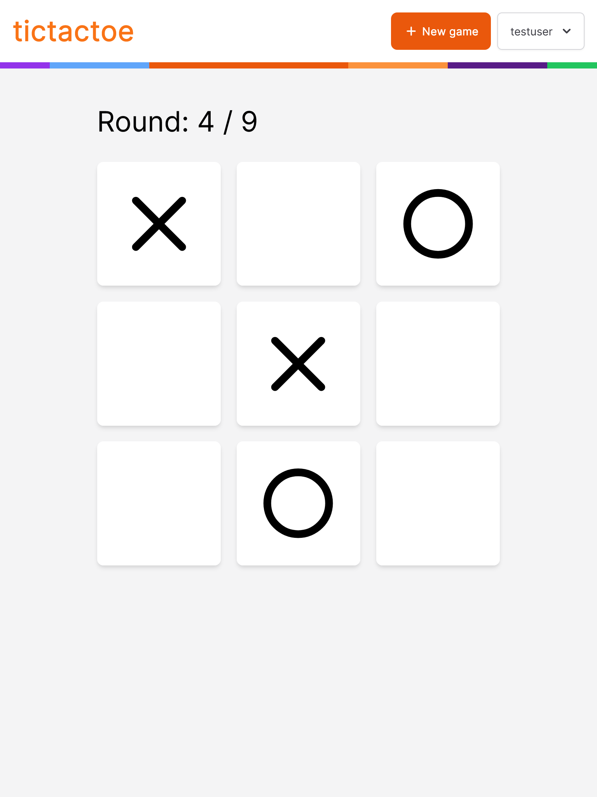
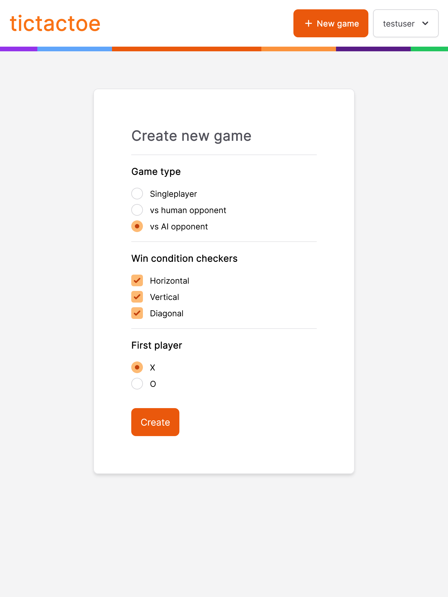

# tictactoe-api

A RESTful API written with .NET 5 that acts as the backend server for a TicTacToe game client. Project is structured using the [Clean Architecture](https://blog.cleancoder.com/uncle-bob/2012/08/13/the-clean-architecture.html). Code is written with SOLID, DRY, YAGNI, KISS principles in mind and uses Design Patterns wherever applicable.

## Technologies Used

- .NET 5
- CQRS (using [MediatR](https://github.com/jbogard/MediatR))
- Domain Driven Design
- MongoDB
- ASP.NET Core Identity with JWT authentication
- [FluentValidation](https://fluentvalidation.net/)
- Docker

---

## Game Features

- Users can create a game with the following game types:
    - **Singleplayer:** One user makes moves for both sides, can be also used for IRL multiplayer
    - **Against AI:** User can select a difficulty level (Random or Hard), and play against the computer. The random AI algorithm simply chooses a random empty tile to play, whereas the Hard algorithm uses the [Minimax algorithm]() to make the most optimal move.
    - **Against Human:** One user creates a game, and another one joins that game. Afterwards, they can each make moves in turn.
  

